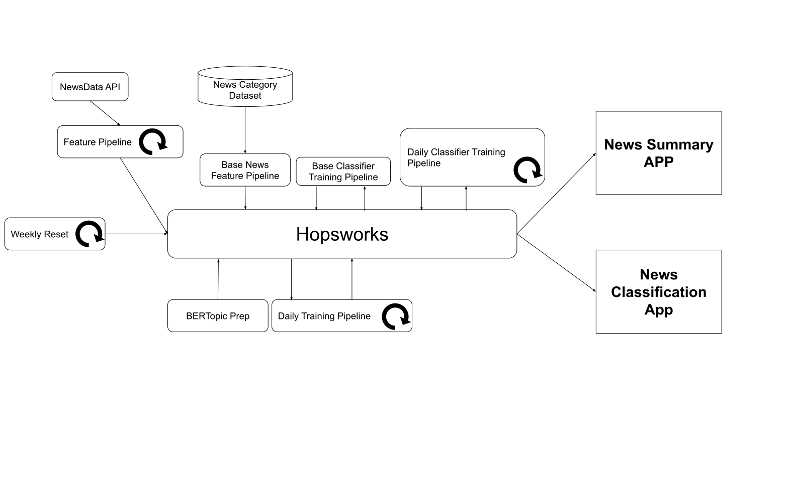
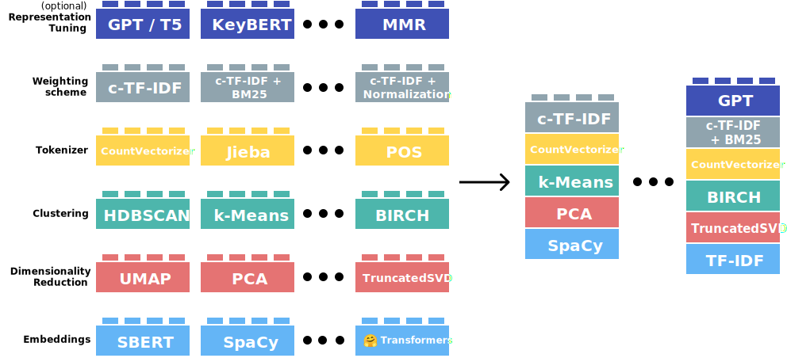

 
# Installation
All dependencies are listed inside the requirements.txt file at the base of this github directory. We used python 3.11.2. The code for the news summary is found within BERTopic_news_summary and the code for the classifier is found within News_Category_Classification.

# Description
In this project our goal was to prepare a Hugging Face application that displays the current world news grouped into the most important topics. In order to find topics we use BERTopic, which is a python library that uses machine learning models in order to find topics in a list of documents. In our case these documents are news articles from different sources. In addition to our news Summary application we also provide a news category classifier. We used Hopsworks to store models and features. News data is constantly changing, in order to fetch new data and retrain models on a schedule we used Modal. We then created apps to display our results on Hugging Face. 

# Apps
## News Summary
https://huggingface.co/spaces/cotxetj/final_project
# News Category Classification
https://huggingface.co/spaces/Sleepyp00/News_Category_Classifier

# News Summary Application
BERTopic provides a straightforward way of producing topics from a list of documents. It can be described as a pipeline which requires different stages to be defined. These include an embedding model which is applied to get the document embeddings, a dimensionality reduction algorithm, a clustering algorithm, tokenizer and weighing scheme. BERTopic has default models however it's possible to swap models in order according to the particular task. See below:

# Dataset
BERTopic uses a pre-trained sentence embedding model in order to perform text encoding. This meant that we did not have to deal with a large text dataset in order to train a sentence transformer of our own. The rest of the steps in the topic pipeline involved models without any weights, only hyper parameters, which meant that we did not have the need to train these models on a dataset either. The process of preparing topics involved fitting BERTopic to a collection of news articles. We obtained news articles from the NewsData API https://newsdata.io/.

# Method
The process of preparing news topics was divided into a feature and training pipeline with regular updates. We customize BERTopic according to our needs by specifying what embedding model, dimensionality reduction, clustering, vectorizer and topic representation model we want. We picked most of the models according to the BERTopic best practice guide https://maartengr.github.io/BERTopic/getting_started/best_practices/best_practices.html. We did however alter the hyper-parameters of the clustering and dimensionality reduction to get a decent number of topics. We also decided to replace the default embedding model with all-mpnet-base-v2 since it is able to handle inputs of 384 word pieces which is around 350 words, longer documents are truncated. Most news articles are not more than 800 words and the most important information is usually at the beginning. We therefore decided that it was an appropriate model to use and that there was no need to try to produce an embedding for whole articles. The different models are uploaded to the model registry via BERTopic_prep.py which enables us to reuse them for different parts of the system. It also ensures that the embeddings are consistent. 

The feature pipeline feature_pipeline.py makes requests to the new API in order to obtain news from the last 24 hours. News are saved if they have a title, link and aren't empty. Information about the articles are saved to the Hopsworks feature store. This information includes information needed to display the article in the app such as the link and title. If the category is provided we store that as well. Category information is used as labels to fine-tune the classifier model. We also store the embeddings of the articles. The model used to encode the data is downloaded from the model registry. The feature pipeline is run every two hours to prevent rate limiting. The last page visited is saved as a file in Hopsworks to make sure that we don't fetch the same articles every time.

The training pipeline daily_training_pipeline.py downloads all the necessary models for BERTopic along with the embeddings of the news articles from the last few days. Pre-calculating embeddings can be provided to BERTopic in order to speed up clustering. The resulting topics and their respective documents are then uploaded to the feature store so that they can be presented in our Huggingface App. 

# Result
It's challenging to measure the quality of the topics provided since they are subjective. We were able to generate a list of news topics for the articles we fetched over the last few days. Simply by looking at the topics ourselves we found that BERTopic was able to identify topics that one would expect to find. For example, some of the main topics at the end of 2023 include the Palestine and Israel conflict as well as the Ukraine and Russia conflict, both of which were identified by BERTopic. It did however also tend to find topics mainly containing ads. If we had more resources we would like to look into different ways of ordering the topics and presenting them in our app as well as collecting data of which ones receive the most attention though clicks for example. This data could be used to form heuristics to assess the quality of the topics. We would also look into some ways of filtering out less interesting topics such as adverts.

# News Category Classification
We created a classification app which takes a news article as input and determines which category of news it best belongs to. This classifier is updated on a schedule where it is fine-tuned on recent news data. 

# Dataset
In order to train our news classifier model we made use of the news category dataset https://arxiv.org/abs/2209.11429, we also made use of labels provided by NewsData API. News websites usually have different categories that have been manually selected which means that new data can always be gathered without much cost. 

# method
In order to train a classification model we decided to use transfer learning. Training a text to embedding encoder is expensive and takes a lot of resources. Fortunately there are many pretrained sentence embedding models which can be selected. In our classifier we decided to use the all-mpnet-base-v2 model again for the same reasons as mentioned above. We then added a MLP head in order to perform classification on the embeddings. We tried to only update the weights in the MLP and found that this gave satisfactory results so we decided to stick with this relatively simple approach. Feature preparation and training was again split into two different pipelines. In base_news_feature_pipeline.py we extract all the articles from the categories we are interested in, politics, science, entertainment, sports and business. The news articles are encoded and the resulting features are stored on Hopsworks. These features are used to train the base classifier which we fine tune or recent data with regular intervals. In training_pipeline_base_classifier.py we download the features and train the classifier which we then upload to the model registry. The daily_classifier_training.py script is the training pipeline that fine-tunes the classifier on recently stored news data. In this case we use the data uploaded to Hopsworks from the feature pipeline. Fine-tuning occurs daily in order to keep the classifier updated. In order to handle the somewhat uneven distribution of classes we decided to weigh them according to $\omega_i=\frac{N}{m*n_i}$ where $N$ is the total number of samples in the dataset, $m$ are the number of classes and $n_i$ are the number of data points in class i. This way relatively small classes were weighed higher and vice versa thus encouraging similar accuracy for each class. Data was not normalized since normalization provided no significant improvement. This can be because the text embeddings are already well behaved on the pre-trained model.

# Result
In this case we can get a quantitative measure of the quality of the model we have trained. We found that the classifier has similar accuracy for each class. We therefore use accuracy to measure the performance of the model. Our base classifier achieved an accuracy of around 80\% on the news category dataset. Fine tuning it on recent news data resulted in a final accuracy, on the current data of around 82-85\% which we deemed sufficient.

